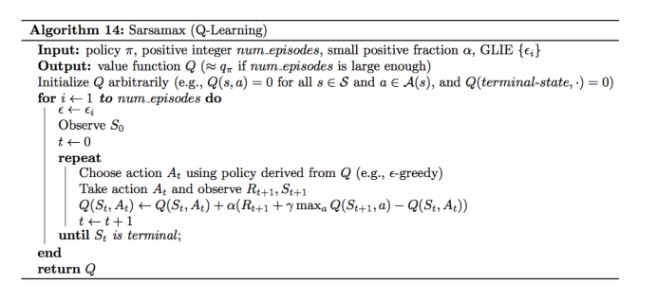
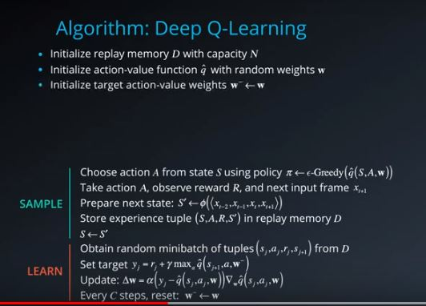
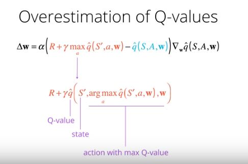
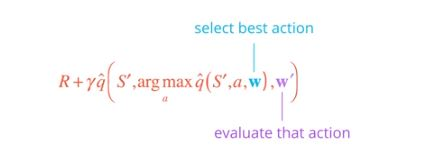

#### Agent with best results in action:

#### Remarques
To be able to follow this project description in detail, 
basic knowledge about the following topics would be helpful:
- python
- neuronal networks
- pytorch
- numpy (python package)

#### Mathematical basis of RL-Systems
The mathematical basis of RL-algorithms are the "Bellman Equations".  
By using the "Bellman Equations" for "Dynamic Programming" in  
discrete state-spaces, it is possible to compute the optimal behavior of 
an agent. This computation proceeds in iterations. 
The behavior of an agent is stated with a policy.
A policy is a probability-distibution over actions given states.
If you want to go deeper in this topic, 
I can highly recommend the following post of Mohammad Ashraf in 4 episodes:  
[Reinforcement Learning Demystified](https://towardsdatascience.com/reinforcement-learning-demystified-36c39c11ec14) 

#### The Q-Learning-Algorithm (also named as Sarsamax)
The follwing depiction shows the pseudo-code of the Q-Learning iteration algorithm.

  

This algorithm is a variation of the temporal-difference algorithm and is off policy.
Off-policy, because there are two policies in this algorithm.
- the behavior-policy
- the learning-policy  

This algorithm can be applied in a finite state-action world, like a grid-world.

Supposing the agent starts at state_1, the behavior-policy selects with "Epsilon-Greedy" an action_1 and executes this action in his environment.
By doing this, the environment gets back the state-values of the next state (state_2) and
the corresponding reward. 
The learning-policy uses  the recursive update-rule of the Q-Learning algorithm "Q(St, At)..." by
using the max-Q-Value of State_2.
After some iteration-work an optimized Q-Table (table with optimized Q-values of each state) will be created.
The agent use now this Q-table by using the maximum Q-value of each state-action pair. 
Up to now the agent can  move with an optimized policy.

#### Deep-Q-Learning-Algorithm
Deep-Q-Learning (DQN) means, that we use Neural Networks to predict the next action of our agent.
We need DQN, if our agent move in a continous world. This means, that the environment consists of infinitve 
states or actions or both.
We find this case often in our real world.

In a continous world, it is not possible to find an optimal policy for the agent just with "dynamic programming".
The reason is, that we come in a continious world to an unsolvable non-linear equation-system. 

To solve this problem, we use Neural Networks as a function approximator.

Below you see the depiction of the pseudo-code of a DQN-Algorithm which use additionaly the experience reply technique.
With experience replay it is possible, to dampen  the strict correlation of consecutive timesteps of states.
So we gather a bunch of agent-steps, store it and select it a bit later randomly  for our learning-algorithm.
With this technique we discorrelate the given input-stream and make the algorithm more successful.

In a DQN our policy is  represented in a neural network (nn).
The state-data is  our nn-input 
(other examples of state-inputs: pictures of a game or real-time input video-data of a autonomous car, ..)  
and the neural network will approximate the best action by  using the states, actions and rewards.
DQN -like all nn-systems-  are able to find patterns behind the given input data to solve the given issue.

#### Implemented Neural network:

The module "model.py" contains the used  Neural Network (nn) definition.  

This is composed with three fully connected layers with the following
parameter-set:

*First  layer --> input layer:*  
number of input-neurons = 37, according to the number of states
number of output-neurons = 64
activation function = relu

*Second  Layer --> hidden layer:*
number of input-neurons = 64
number of output-neurons = 64
activation function = relu

*Third layer --> output layer*
number of input-neurons = 64
number of output-neurons = 4, according to the action-size.

*General parameters:*  
BATCH_SIZE = 64,  minibatch size  
GAMMA = 0.99, discount factor  
TAU = 1e-3, for soft update of target parameters  
LR = 5e-4, learning rate   
UPDATE_EVERY = 4, how often to update the network  

#### Implementing of the Double-Deep-Q-Networrk (DDQN)-algorithm.
There are different  optimization techniques for DQN's
One of these techniques is the use of a DDQN-networks, which I implemented in this project.

For more detailed information about DDQN-netwoks, have a look in the following science paper
from Hado van Hasselt, Arthur Guez and David Silver about DDQN-Systems.
https://arxiv.org/pdf/1509.06461.pdf?

Overestimating of Q-Values is especially a problem by starting the network training, as we start with a lot of noisy data.
So we can easily get outliers of Q-Values. 

DDQN works with two different neural networks and is constructed to reduce these data-ouliers.
The first network is called  the local network and the second network is called  the target network.
We use results of both networks to improve the network-performance by reducing overstimatings of Q-Values.
A DDQN is constructed to reduce these data-outliers.

The Agent moves with his local network-policy "against" the target network.
The weights of the target network are periodically updated with the weights of the local network 
after a given number of timesteps.
The weights of the local network (w)are constantly updated.
So the local network has a stable target for awhile in view and possible outliers can be reduced with 
data of the target network.
This correction is implemented by using the index of the best action of the primary-network,
for choosing the Q-value of the target network (w-prime).
In other words, we use in both networks the same "direction"(index) but the Q-value itself is
taken from the target network.

#### Testsets and results

*Test*  
I implememented the following control-parameter for testing the system.
See point 5 of the Jupyter Notebook-File "Navigation.ipynb"

*is_double_Q_network = True:* 
With this swich one can turn on/off the DDQN-System, otherwise the DQN-System works.

*is_experience_replay = True/False:*
With this switch one can turn on/off the experience-replay proceeding.

*self.test_on = True/False*
This is a agent-class-Variable, to test the shapes of tensors.
If test_on is True, then during the first loop-pass of the 
learn-methode shapes and contents of important tensors are printed out.
This should help retract what's going on with data-structures.

With this control-switches and the epsilon-greedy parameters
eps_start, eps_end I eps_decay I looked for the best result.

I got the best result with the parameter-set nr 5:
With 357 episodes, I got an everage score 13,08 of the last hundret episodes.

*Interpretation of the result*  

The biggest influence for the result had the use of the experience replay-technique.
On the second place it was the optimization of the epsilon-greedy parameters.
The improvement with DDQN in comparition with DQN was little.

#### Possible Improvements
* Implementing "Grid Search" to identify a better optimized parameter-set. 
* Use of a Dualing-Q-Network-algorithm
* Use of Priorized experience Replay

